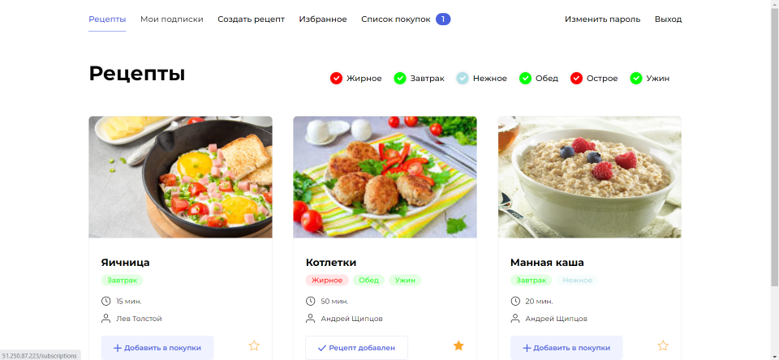

# FoodGram



### Проект выполнен в рамках обучения в YandexPracticum.

В рамках проекта реализована Backend часть разработки, проект развернут в YandexCloud в контейнерах Docker, в качестве базы данных использован Postgress, для обработки Http запросов использован Nginx + Gunicorn. Проект предоставляет функции подписки на авторов, создания рецептов, формирования списка покупок.

### Полезные ссылки:

Для доступа в адмнику используйте:

```
Login: admin
Password: admin
```

Для доступа к тестовому пользователю:

```
Email:  leo-fat@yasnaya.ru
Password: leo
```

[Проект](http://51.250.87.223/)

[Админка проекта](http://51.250.87.223/admin/)

### Как запустить проект:

1. Клонировать репозиторий:

   ```
   git clone git@github.com:Bigbrotherx/foodgram-project-react.git
   ```
2. Перейти в папку с проектом:

   ```
   cd foodgram-project-react/infra
   ```
3. Создать в папке ./infra .env файл со следующим содержанием:

   ```
   DB_ENGINE= # указываем, что работаем с postgresql
   DB_NAME= # имя базы данных
   POSTGRES_USER= # логин для подключения к базе данных
   POSTGRES_PASSWORD= # пароль для подключения к БД (установите свой)
   DB_HOST= # название сервиса (контейнера)
   DB_PORT= # порт для подключения к БД
   SECRET_KEY = # произвольная строка содержащая секретный ключ Django приложения
   ```
4. Запустить билд скрипт выполнив следующие команды:

   ```
   >> sudo chmod +x server-build.sh
   >> ./server-build
   ```
5. Приложение доступно по адерсу

   ```
   http://localhost/
   ```
